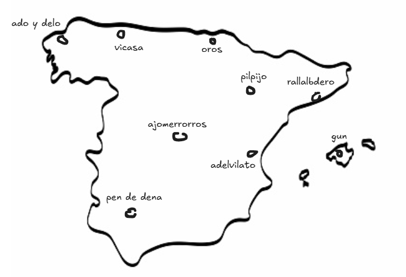

# 📒 My Bigrams Study Notes

This repository contains notebooks based on [the second lecture](https://www.youtube.com/watch?v=PaCmpygFfXo&list=PLAqhIrjkxbuWI23v9cThsA9GvCAUhRvKZ&index=2&ab_channel=AndrejKarpathy) of Andrej Karpathy's series **"Neural Networks: Zero to Hero"**. I've made some tiny modifications and added additional comments. 📝

The video covers the implementation of a bigram character-level language model, where the model predicts the next character based on and only on the previous one.
We build our first model with a probabilistic approach and the second one with our precios gradiente descent.

Instead of using a dataset of people's names, I used a dataset of municipalities in Spain, because I thought it would be more fun.

As you can see, results are mediocre (as expected) but we are starting to dign into the NLP cave.

## 🔗 References

📌 **Dataset**:

- ["Municipios de España"](https://datos.gob.es/es/catalogo/a09002970-municipios-de-espana) published by *Generalitat de Catalunya* in [datos.gob.es](https://datos.gob.es/es/)
📌 **Karpathings**:
- [Neural Networks: Zero to Hero Lecture Series](https://www.youtube.com/watch?v=VMj-3S1tku0)

 

