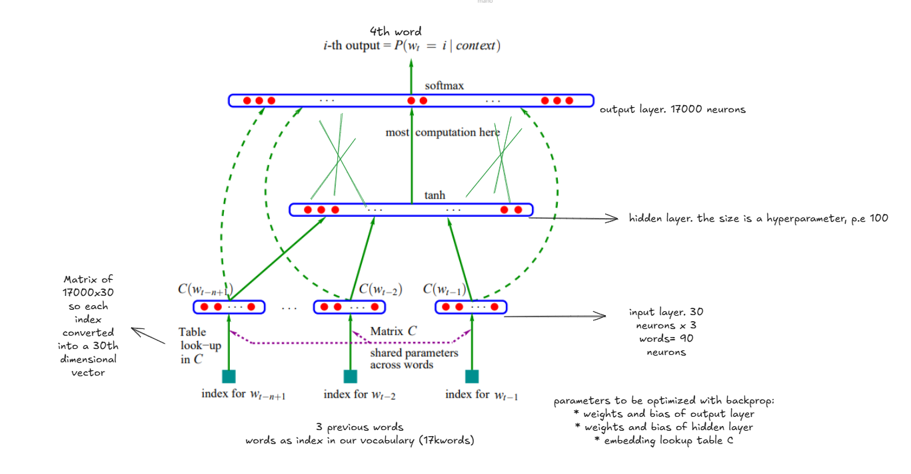
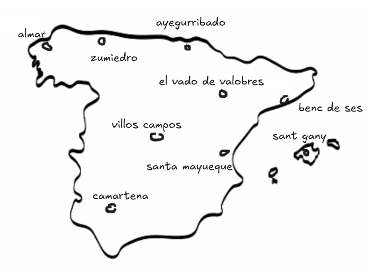
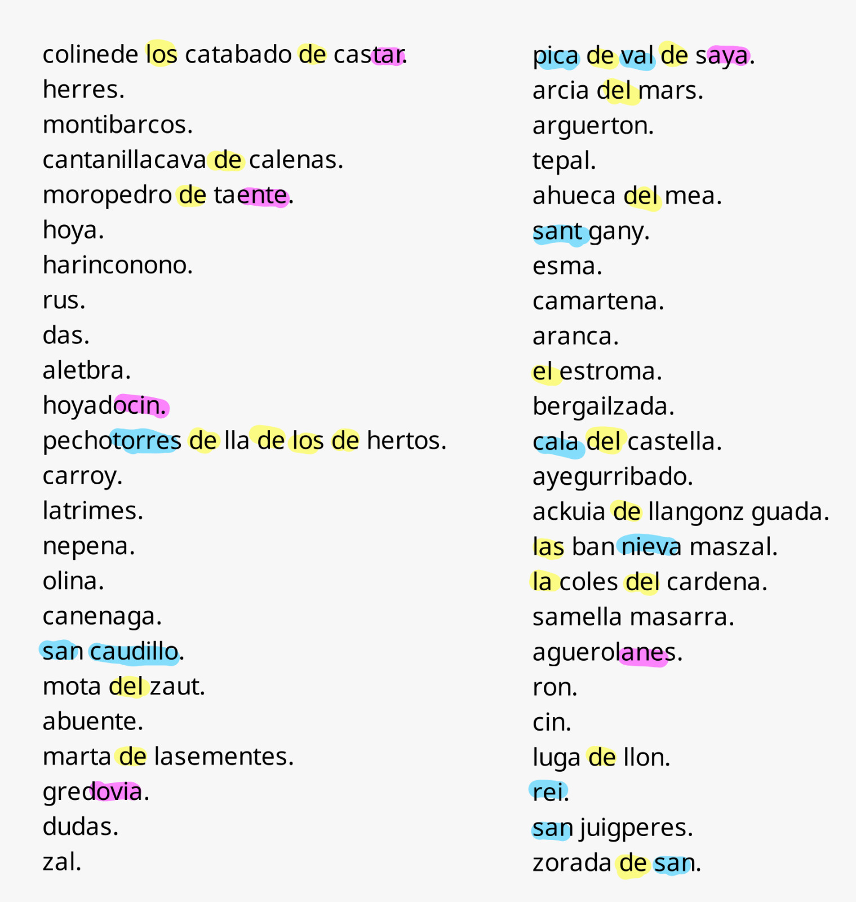

# 📒 My MLP Study Notes

This repository contains notebooks based on [the third lecture](https://www.youtube.com/watch?v=TCH_1BHY58I) of Andrej Karpathy's series **"Neural Networks: Zero to Hero"**. I've made some tiny modifications and added additional comments. 📝

The video covers the implementation of a multi layer perceptron model, which predicts the next character based on the three previous one.

The solution is based on the one describe in the paper *A Neural Probabilistic Language Model* that can be summarize in the image below:



Some adaptations were made to work at character level, instead of word level.

Instead of using a dataset of people's names like in the lecture, I used a dataset of municipalities in Spain.

# 📈 Results



MLP model significantly outperforms the previous bigram model, both quantitatively and qualitatively

We reach a **loss** of **1.8676**, way smaller than the 2.29 with the bigram model

Some interesting thing emerged from sampling 100 results. You can take a look at the full list on the notebook or at the end of this readme



*  Frequent appearance of common Spanish prepositions and articles, such as "los", "de", "del", and "la".
*  Longer and meaningfull words such as "torres", nieva", "cala", "fuente", "campos", "monte".
  * You can find a "caudillo", which is a remnant of Spanish glorification of the Francoist dictatorship, sadly still present in some contemporary toponyms.
  * This words tend to collapse for lenghts above 4characters(coherent with our context). However you can find a notably "arzobispo" word
*  Appearence of common suffixes.


## 🔗 References

📌 **Original paper**:
- [A Neural Probabilistic Language Model](https://www.jmlr.org/papers/volume3/bengio03a/bengio03a.pdf), by Bengio, Ducharme, Vincent and Jauvin

📌 **Dataset**:
- ["Municipios de España"](https://datos.gob.es/es/catalogo/a09002970-municipios-de-espana) published by *Generalitat de Catalunya* in [datos.gob.es](https://datos.gob.es/es/)
 
📌 **Karpathings**:
- [Neural Networks: Zero to Hero Lecture Series](https://www.youtube.com/watch?v=VMj-3S1tku0)

## 🤖 Sampled results
```
colinede los catabado de castar.
herres.
montibarcos.
cantanillacava de calenas.
moropedro de taente.
hoya.
harinconono.
rus.
das.
aletbra.
hoyadocin.
pechotorres de lla de los de hertos.
carroy.
latrimes.
nepena.
olina.
canenaga.
san caudillo.
mota del zaut.
abuente.
marta de lasementes.
gredovia.
dudas.
zal.
pica de val de saya.
arcia del mars.
arguerton.
tepal.
ahueca del mea.
sant gany.
esma.
camartena.
aranca.
el estroma.
bergailzada.
cala del castella.
ayegurribado.
ackuia de llangonz guada.
mez.
las ban nieva maszal.
la coles del cardena.
samella masarra.
aguerolanes.
ron.
cin.
luga de llon.
rei.
san juigperes.
zorada de san.
alcazarzobispontriko-urceocina de terroses.
melillares.
almar.
hueta.
bujal.
herra.
santa mayueque.
vilves.
hitorrada de tras.
almosiles.
la pozo de pria de alt.
arcona.
cusan juan de alfaurierra.
bija.
alparejordome de la celi.
vede fuente.
zumiedro.
esguera de tozbarcenc del pueblegordos.
burgel pedras.
urria.
mieunx.
sola zudar.
seres.
cas.
bustillar del montivigorell de cara de san campos.
monte.
horcullo de gre.
carzuelo.
ferosa de sega.
venteros de arralmolomgadefuente.
banes.
bena.
los otenas plarri.
iava de duerosar.
vellanos.
aldalacentea.
nuevaceda.
gilbonza-ponte de la carra.
el ollos de cuel.
iturindaiguertell.
vila vegade.
aria de pinoja.
villos campos.
el vado de valobres.
blina.
fres gadeobista.
berosero de campo.
benc de ses.
cerraced.
agumiellboll.
caseca.
```

