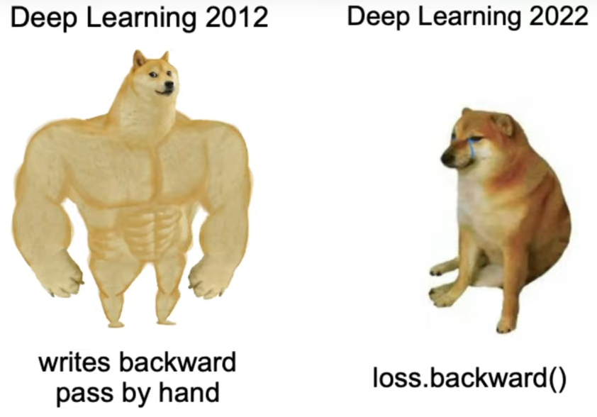

# 📒🥷 My Backprop Ninja Study Notes

This repository contains a notebook based on [the fifth lecture](https://www.youtube.com/watch?v=q8SA3rM6ckI&) of Andrej Karpathy's series **"Neural Networks: Zero to Hero"**. I've made some tiny modifications and added additional comments. 📝

Notebook covers the manual backpropagation of the previos MLP model.

## 🔗 References

📌 **Dataset**:
- ["Municipios de España"](https://datos.gob.es/es/catalogo/a09002970-municipios-de-espana) published by *Generalitat de Catalunya* in [datos.gob.es](https://datos.gob.es/es/)
 
📌 **Karpathings**:
- [Neural Networks: Zero to Hero Lecture Series](https://www.youtube.com/watch?v=VMj-3S1tku0)