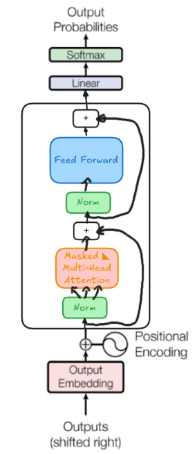
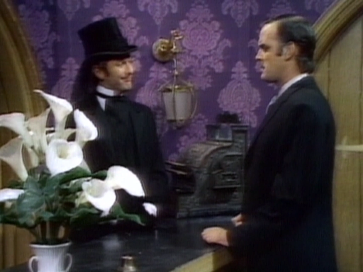

# 🤖 My Transformers Study Notes

This repository contains notebooks based on [the seventh lecture](https://www.youtube.com/watch?v=kCc8FmEb1nY&ab_channel=AndrejKarpathy) of Andrej Karpathy's series **"Neural Networks: Zero to Hero"**. I've made some tiny modifications and added additional comments. 📝

Work is divided into 2 notebooks:

- [1📕](gpt_developing.ipynb): Some data treatement, explanations about AdamW optmizer and first explanations about self attention.
- [2📘](self_attention.ipynb): Didactical notes about the self attention mechanism, residual connections, layer normalization and dropout. Finally a sum up of the components int the transformer block.

And 4 python script:

```
|
bigram/
├── train_bigram.py     # Training script for the bigram model
├── generate_bigram.py  # Text generation script using trained bigram model
|
gpt/
├── train_gpt.py        # Training script for the GPT model
└── generate_gpt.py     # Text generation script using trained GPT model
```

Instead of the original tinyShakespeare, I used a dataset composed with the scripts of 45 episodes across 4 seasons of Monty Python's Flying Circus 🦶

# Implementation

The implementation follows a progressive approach, starting with a simple bigram model and building up to a full transformer-based GPT model.



# 📈 Results

## Quantitative results.

```python
## hyperparameters

batch_size = 64      # Number of parallel sequences
block_size = 256     # Maximum context length for predictions
max_iters = 5000     # Total training iterations
eval_interval = 500  # Evaluation frequency
learning_rate = 3e-4 # Learning rate (crucial for transformer models)
n_embd = 384        # Embedding dimension
n_head = 6          # Number of attention heads
n_layer = 6         # Number of transformer layers
dropout = 0.2       # Dropout rate for regularization
```


We achieve a train loss of 0.899 and a val loss of 1.309 after training during 14 min with a RTX 4070


## Qualitative results

#### Sentence Coherence
The model demonstrates the ability to form complex English sentences despite using only character-level tokens.
Sentences are mostly grammatically correct; however, they exhibit a high level of randomness🤪.

```
Mr Vibrating(John Cleese): Have you seen me?
Man(Michael Palin): No, I don't want to play in the block of the trees.
Man(Michael Palin): Excuse me.
Mr Vibrating(John Cleese): Oh, I'm going to have to see a bit of Guddoctor back of the mounting.
```

#### Script Formatting
- The model successfully adheres to a structured script format:

    - Each line starts with a character name followed by an actor's name in parentheses.
    - The five names John Cleese, Terry Jones, Eric Idle, Michael Palin, and Graham Chapman appear in the generated text (as well as the actress Carol Cleveland). Names and surnames always appear together and are correctly combined.
    - The <Direction> tag tends to contain stage directions.
```
<Direction: Cut to a background.> 

Girl(Carol Cleveland): Well I'm sorry? They're about so pinior. 

Gary(Eric Idle): You're fair than my household? 

Barbarard(Michael Palin): The house of publiciping a pound, am who is Consult? 

Arthur(Eric Idle): Where's third Minister that he blown that. 
```

The results indicate that character-level tokenization can be surprisingly effective in capturing structure and coherence in text generation. While some generated sentences lack meaning, the formatting, character consistency, and dialogue flow suggest that the model has internalized key linguistic and structural patterns.

A full generated text of 10000 characters can be found [here](output.txt)

```
Announcer(John Cleese): Look at you. 

Undertaker(Graham Chapman): And now for something completely different. 
```



## 🔗 References

**WaveNet Paper**:  
[Attention is all you need](https://arxiv.org/pdf/1706.03762)  
*Ashish Vaswani, Noam Shazeer, Niki Parmar, Llion Jones,Aidan N.Gomez, Łukasz Kaiser, Illia Polosukhin*

**Residual Connections**:  
[Deep Residual Learning for Image Recognition](https://arxiv.org/pdf/1512.03385)  
*Kaiming He, Xiangyu Zhang, Shaoqing Ren, Jian Sun*


**Dropout**:  
[Dropout: A Simple Way to Prevent Neural Networks from Overfitting](https://jmlr.org/papers/volume15/srivastava14a/srivastava14a.pdf)
*Nitish Srivastava, Geoffrey Hinton, Alex Krizhevsky, Ilya Sutskever, Ruslan Salakhut*


**Dataset**:
- [Original dataset](https://www.kaggle.com/code/valkling/monty-python-scripts-database-to-text) upload in kaggle by Valking
- [Clean dataset](https://www.kaggle.com/code/alvarofg21/monty-python-scripts-text-cleaning) upload in kaggle by myself
 
**Karpathings**:
- [Neural Networks: Zero to Hero Lecture Series](https://www.youtube.com/watch?v=VMj-3S1tku0)

**Other stuff**:

Transformers have been a major breakthrough in machine learning, so the web is full of learning resources. To keep it short, I’ll share some of the ones I found most useful—which won’t surprise you, given that I’m a big 3Blue1Brown fanboy.

[Visualizing transformers and attention](https://www.youtube.com/watch?v=KJtZARuO3JY&ab_channel=GrantSanderson)
*Talk for TNG Big Tech Day '24- Grant Sanderson* 

5️⃣Ⅰ **[Large Language Models explained briefly | DL5](https://www.youtube.com/watch?v=LPZh9BOjkQs&list=PLZHQObOWTQDNU6R1_67000Dx_ZCJB-3pi&index=6&ab_channel=3Blue1Brown)**

5️⃣Ⅱ **[Transformers (how LLMs work) explained visually | DL5](https://www.youtube.com/watch?v=wjZofJX0v4M&list=PLZHQObOWTQDNU6R1_67000Dx_ZCJB-3pi&index=6&ab_channel=3Blue1Brown)**

6️⃣ **[Attention in transformers, step-by-step | DL6](https://www.youtube.com/watch?v=eMlx5fFNoYc&list=PLZHQObOWTQDNU6R1_67000Dx_ZCJB-3pi&index=7&ab_channel=3Blue1Brown)**  

7️⃣ **[How might LLMs store facts | DL7](https://www.youtube.com/watch?v=9-Jl0dxWQs8&list=PLZHQObOWTQDNU6R1_67000Dx_ZCJB-3pi&index=8&ab_channel=3Blue1Brown)**  
